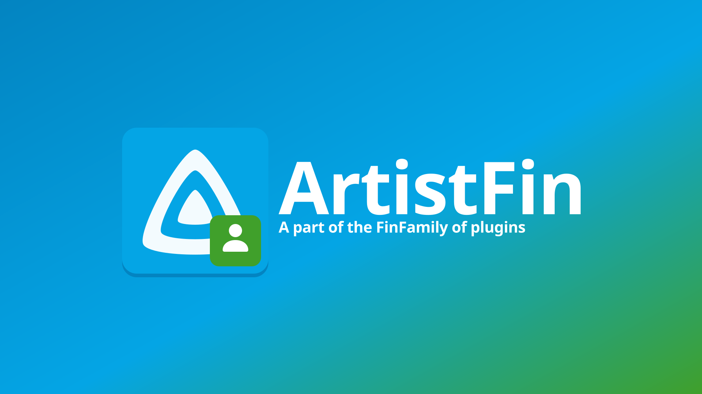
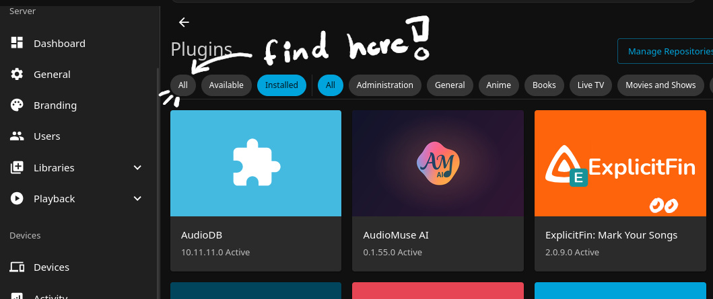

<div align="center">

<p align="center">
  
</p>

# ArtistFin: Know Your Artists

<p align="center">
  
</p>

A Jellyfin plugin that fills **artist bios**, **images**, and profile details — the Fin counterpart to MusicFin’s album/track tagging.

**Jellyfin 10.11+** · scheduled task + settings button + native Identify/Refresh provider.

## How it works

**Scheduled task** (`ArtistFin: Know Your Artists`) — fills artists that are missing a bio and/or primary image (weekly by default).
**Settings → Refresh all artists** — queues a force overwrite (runs under Scheduled Tasks).
Lookups combine:
   **MusicBrainz** — IDs, hometown, formed/disbanded, genres, official site
   **TheAudioDB** — images, genre, country, formed year (bios when the free API returns them)
   **Deezer** — high-res primary artist images
   **Wikipedia** — biography extract (the reliable free bio source)
Also registers as a Jellyfin metadata + image provider so **Identify** / **Refresh** on an artist can use ArtistFin.

Skips junk names like *Various Artists*.

## Installing
**Step 1**
<p align="center">
  
</p>

**Dashboard --> Plugins --> Manage Repositories** --> **+ New Repository**:
   Name: `FinPlugins` (or whatever :P )
   URL: `https://raw.githubusercontent.com/TidBits16/FinPlugins/main/manifest.json`
   <br>
   (p.s. this bundle includes my other FinPlugins since they are designed to work together. ***they are not required to install!***)
<br>
<center><strong>**Then Restart JellyFin!**</strong></center>

**Step 2**
<p align="center">
  
</p>

**Plugins** --> **All** --> **ArtistFin: Know Your Artists** --> **Install**

<center><strong>**Once Installed, Restart JellyFin Again!**</strong></center>

## Build Locally

For development or packaging your own build:

```bash
dotnet build Jellyfin.Plugin.ArtistFin.csproj -c Release
./scripts/package.sh
```

The release zip will be in `dist/`.

Designed for **Jellyfin 10.11+** (you probably have this already :D)
<p align="center">
  <a href="https://github.com/TidBits16/FinPlugins">
    
  </a>
</p>
</div>
