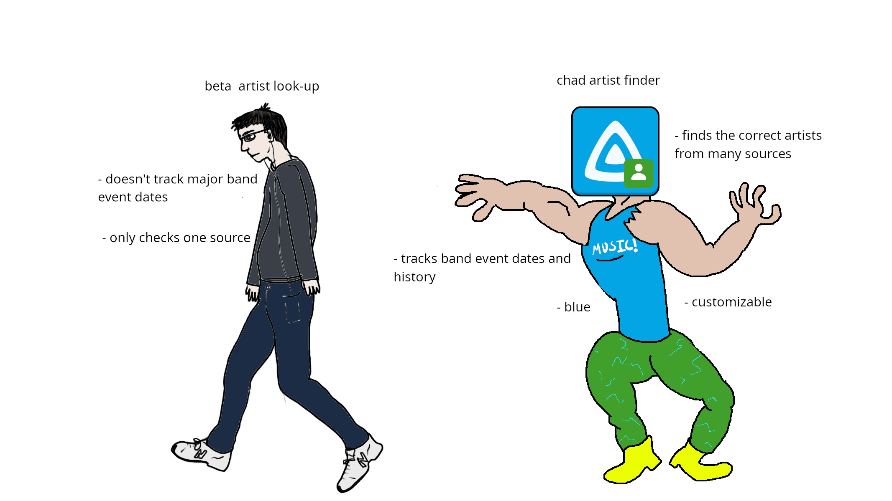

<div align="center">
<p align="center">
  
</p>

# ArtistTagShelf: Know Your Artists

> Formerly <strong>ArtistFin</strong>. Same plugin GUID — settings carry over when you update.

A Jellyfin plugin that fills <strong>artist bios</strong>, <strong>images</strong>, and <strong>profile details</strong> (<em>the TagShelf counterpart to MusicTagShelf’s album/track tagging</em>).

<p align="center">
  
</p>

## Providers

<table align="center">
  <tr><td align="left"><strong>MusicBrainz</strong></td><td align="left">IDs, hometown, formed/disbanded, official site</td></tr>
  <tr><td align="left"><strong>TheAudioDB</strong></td><td align="left">images, country, formed year (bios when available from the free API)</td></tr>
  <tr><td align="left"><strong>Deezer</strong></td><td align="left">high-res primary artist images</td></tr>
  <tr><td align="left"><strong>Wikipedia</strong></td><td align="left">biography extract (the reliable free bio source)</td></tr>
</table>
<br>
Also registers as a Jellyfin metadata + image provider, so <strong>Identify</strong> / <strong>Refresh</strong> on an artist can use ArtistTagShelf.

Skips junk names like <em>Various Artists</em>.

## Installing
<strong>Step 1</strong>
<p align="center">
  
</p>

<strong>Dashboard --> Plugins --> Manage Repositories</strong> --> <strong>+ New Repository</strong>:<br>
Name: <code>TagShelfPlugins</code> (or whatever :P )<br>
URL: <code>https://raw.githubusercontent.com/TidBits16/TagShelfPlugins/main/manifest.json</code><br>
<br>
(p.s. this bundle includes my other TagShelfPlugins since they are designed to work together. <strong><em>they are not required to install!</em></strong>)<br>
For just <strong>ArtistTagShelf</strong> you can use this URL: <code>https://raw.githubusercontent.com/TidBits16/ArtistTagShelf/main/manifest.json</code>
<br>
<br>
<strong>Then Restart Jellyfin!</strong>

<strong>Step 2</strong>
<p align="center">
  
</p>

<strong>Plugins</strong> --> <strong>All</strong> --> <strong>ArtistTagShelf: Know Your Artists</strong> --> <strong>Install</strong><br>
<br>
<strong>Once Installed, Restart Jellyfin Again!</strong></center>

## Build Locally

For development or packaging your own build:

```bash
dotnet build Jellyfin.Plugin.ArtistTagShelf.csproj -c Release
./scripts/package.sh
```

The release zip will be in `dist/`.

Designed for <strong>Jellyfin 10.11+</strong> (you probably have this already :D)
<br>
Licensed under the <a href="LICENSE">GNU General Public License v3.0</a>
<p align="center">
  <a href="https://github.com/TidBits16/MusicTagShelf"></a>
  &nbsp;
  <a href="https://github.com/TidBits16/ExplicitTagShelf"></a>
  &nbsp;
  <a href="https://github.com/TidBits16/LyricTagShelf"></a>
  &nbsp;
  <a href="https://github.com/TidBits16/ArtistTagShelf"></a>
</p>
</div>
